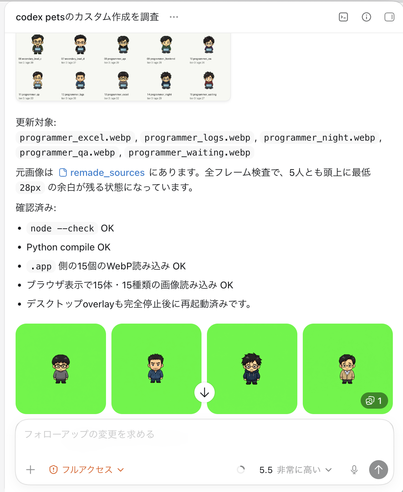

# Ship vs. Quote

**One side ships. One side quotes.**

Codex is so good that it is easy to forget how heavy software work used to feel.

Before tools like Codex, even a small app request could turn into requirement alignment, stakeholder meetings, vendor routing, internal approvals, scope boundaries, estimate reviews, and a PDF that arrived before any software did.

Ship vs. Quote was made to remember that old process for a moment, and then feel the relief of Codex more clearly. It turns the contrast into a playable comparison: one side builds the interface, while the other side builds the quote.

Ship vs. Quote is a playable satire demo for OpenAI DevDay 2026. The same software request is sent to two worlds at once:

- **Codex / GPT-5.5 side:** immediately produces a one-screen app UI.
- **Traditional vendor side:** forms a subcontracting pyramid, holds internal alignment, escalates approvals, and finally returns an estimate.

The piece is built around the feeling that inspired it: after using Codex, the old software process suddenly looked strange. What used to require requirements meetings, handoffs, estimates, vendor coordination, and waiting can now become a working UI direction in seconds. Ship vs. Quote turns that contrast into a visual, interactive joke.

Playable link: https://ship-vs-quote.vercel.app/

## DevDay Submission Snapshot

- **Playable demo:** https://ship-vs-quote.vercel.app/
- **Built for:** `#OpenAIDevDay2026`
- **Uses GPT-5.5:** generates the Codex-side app UI and the vendor-side estimate response through the OpenAI Responses API.
- **Uses Image Gen:** creates the salaryman character system that visually represents the subcontracting pyramid.
- **Uses Codex:** developed end-to-end with Codex as the agentic builder: concept refinement, Image Gen prompting, asset QA, React implementation, API design, responsive polish, and test iteration.
- **Inspired by Codex `/pet`:** the project began after experimenting with Codex's `/pet` and custom pet workflow to make a salaryman-style pet. That small feature made Codex feel less like a tool window and more like a creative workspace with a living character in it.
- **Main creative point:** the same prompt goes to two worlds. One side ships a UI. The other side creates meetings, approvals, assumptions, and a quote.
- **Why it is strong as an OpenAI demo:** GPT-5.5 is not just answering a question. It creates the contrast that makes the piece work: instant interface creation versus traditional enterprise estimation.

## What You Can Try

Open the app and press the demo button to run the default TODO request without an API key.

For custom prompts, visitors can enter their own OpenAI API key and choose a model:

- GPT-5.5
- GPT-5.4 mini

The app then generates:

1. A Codex-style answer with a generated app UI preview.
2. A JTC/vendor-style approval chain and estimate.
3. A PDF-style estimate card.

## Why This Is a Strong OpenAI Submission

This project was designed around the three things the DevDay post explicitly asks for: GPT-5.5, Image Gen, and a playable link. The highest-scoring part of the project is that those pieces are not separate checkboxes. They work together inside one clear, memorable interaction.

### 1. GPT-5.5 is the "ship it" experience

The left side uses the OpenAI Responses API with GPT-5.5 to generate a compact HTML/CSS app UI from a prompt. The goal is not to deploy a real production app, but to show the new interaction pattern Codex makes obvious: describe what you want, and a usable interface direction appears immediately.

The generated UI is rendered in a sandboxed iframe. The server asks for a single-file HTML/CSS output and strips risky elements before display.

This is the best use of GPT-5.5 in the project because the model output becomes the artifact being compared. It is not hidden in the backend; the visitor sees the generated UI as the proof of speed.

### 2. GPT-5.5 also powers the "quote it" satire

The right side also uses GPT, but for the opposite behavior: it generates enterprise-style estimate language, approval-chain dialogue, assumptions, exclusions, and meeting follow-ups.

This creates the core contrast of the piece:

- GPT-5.5 can build a visible UI quickly.
- The vendor pyramid can produce an impressive estimate without shipping software.

Using GPT-5.5 on both sides is intentional. The same model family can either accelerate creation or convincingly simulate the old process that used to slow creation down. That tension is the joke, and it is also the product message.

### 3. Image Gen was used as a production asset pipeline, not decoration

The salaryman pyramid was created as a character system with OpenAI image generation assisted by Codex.

The production process was deliberately agentic:

- I asked Codex to help create a visual subcontracting pyramid, not just one isolated character.
- Codex helped turn the idea into a cast: a senior prime contractor, internal system department members, first-tier vendors, and programmer-company workers.
- Instead of manually drawing each person one by one, I used Codex to iteratively generate, inspect, repair, and integrate the character assets.
- Codex then wired those assets into the React app as animated pyramid characters.

This was one of the strongest parts of the experience: the same assistant that helped reason about the product concept could also call image generation, evaluate the generated assets, fix framing issues, and immediately place the results into the working app.

The Image Gen work is central to the submission because the characters are the interface. Without the generated salarymen, the right side would only be text. With them, the viewer immediately understands the organizational pyramid before reading any explanation.

<p align="center">
  
</p>

<p align="center">
  <sub>Codex coordinating the Image Gen character workflow: instead of manually prompting GPT Image one asset at a time, I could ask Codex to create, inspect, repair, and integrate multiple salaryman characters as a smooth production loop.</sub>
</p>

### 4. Codex `/pet` was the spark

The first version of this idea started from Codex's `/pet` and custom pet feature. I tried making a salaryman-style pet, and that experiment changed the direction of the project: instead of only building a normal app demo, I wanted to make the characters themselves part of the software experience.

That is a genuinely strong feature of Codex. `/pet` is small on the surface, but it makes the development environment feel playful, personal, and expressive. In this project, that playfulness became the bridge from "custom pet" to "animated subcontracting pyramid" to a full GPT-5.5 comparison demo.

## What Makes This Worth Reviewing

- **The concept is legible in seconds:** "Ship vs. Quote" communicates the whole comparison before the user reads the README.
- **The demo works without a key:** judges can press the demo button and see the experience immediately.
- **GPT-5.5 is visible:** generated UI and estimate language are both part of the user-facing output.
- **Image Gen is visible:** the character pyramid is not a background asset; it is the main visual metaphor.
- **Codex `/pet` inspired the format:** the project grows directly out of Codex's custom pet experience, turning a playful IDE feature into a larger interactive artwork.
- **Codex is visible in the story of the build:** the project itself demonstrates how Codex compressed product thinking, image generation, frontend implementation, and testing into one workflow.
- **The satire supports the product message:** the joke is not anti-software process. It is pro-Codex: the old process makes Codex feel more valuable.

## How It Was Built

The project was built with Codex as the main development partner.

The workflow looked like this:

1. **Concept exploration**
   The earliest spark came from experimenting with Codex's `/pet` and custom pet workflow. Making a salaryman-style pet showed how a small character feature could turn a coding environment into something more expressive. From there, the concept expanded into the contrast: Codex feels like instant shipping, while traditional enterprise software often starts with meetings and estimates.

2. **Character creation**
   Codex helped create salaryman-style characters with OpenAI image generation. The characters were not just decorative; they became the visual metaphor for the subcontracting pyramid.

3. **Asset iteration**
   Several generated characters had framing and scale problems. Codex helped identify which assets were clipped, regenerate them, normalize proportions, and integrate the corrected WebP files.

4. **Interactive prototype**
   Codex built the first local web app showing a pyramid of animated salarymen. That prototype became the visual foundation for the final comparison app.

5. **Next.js app**
   The final version became a Next.js / React app with a Codex-style interface, a prompt composer, generated UI preview, vendor-side animation, and PDF-style estimate preview.

6. **OpenAI API integration**
   The API route uses the Responses API. The implementation was split into two structured generations:
   - Codex UI generation
   - JTC estimate generation

   This made the app more reliable. If the estimate side fails, the Codex-generated UI can still be shown while the estimate falls back gracefully.

7. **Testing and iteration**
   Codex ran matrix tests across Japanese/English, GPT-5.4 mini/GPT-5.5, and multiple prompts such as calculator and timer apps. The final tested version succeeded across the matrix.

## Technical Details

- Framework: Next.js / React
- AI: OpenAI Responses API
- Models: GPT-5.5 and GPT-5.4 mini
- Visual assets: OpenAI image generation, integrated with Codex
- Generated app preview: single-file HTML/CSS in sandboxed iframe
- Deployment: Vercel
- PDF: PDF-style preview card, not server-side PDF generation

## Safety and Cost Design

- No API key is stored by the app.
- If a server-side `OPENAI_API_KEY` is not configured, visitors can still run the default demo.
- Custom prompts can use a visitor-provided API key.
- Generated UI is rendered in `iframe sandbox="allow-scripts"` via `srcDoc`.
- The API route strips scripts, iframes, objects, embeds, external links, and inline event handlers from generated HTML.
- The app does not run generated code on the server.
- The app does not install packages, run Docker, create repositories, or deploy user-generated apps.

## Run Locally

```bash
npm install
npm run dev -- --port 3010
```

Open http://localhost:3010.

Optional `.env.local`:

```bash
OPENAI_API_KEY=your_openai_api_key
OPENAI_MODEL=gpt-5.4-mini
```

If `OPENAI_API_KEY` is not set, the initial TODO demo still works. Arbitrary prompts require either an environment API key or a user-entered API key.

## Deploy

Use Vercel for the playable link. GitHub Pages is not enough because this app uses a Next.js API Route at `app/api/duel/route.js`.

Recommended Vercel settings:

- Framework: Next.js
- Environment variables:
  - `OPENAI_API_KEY` optional
  - `OPENAI_MODEL=gpt-5.4-mini` optional

If you do not want to pay API costs for public visitors, leave `OPENAI_API_KEY` unset. Visitors can still try the built-in demo and can optionally bring their own API key for custom prompts.

## Submission Note

```text
#OpenAIDevDay2026

Ship vs. Quote: GPT-5.5 instantly ships a one-screen UI, while a traditional vendor pyramid escalates meetings and returns an estimate.

Built with Codex, GPT-5.5 via the OpenAI Responses API, and OpenAI image generation for the animated salaryman pyramid.

Playable: https://ship-vs-quote.vercel.app/
```

---

# 日本語版

## 作品コンセプト

Codexという素晴らしいツールに触れていると、これまでのソフトウェア開発がどれだけ煩雑だったかを忘れてしまいそうになります。

以前は、小さなアプリを作るだけでも、要件整理、認識合わせ、関係者会議、ベンダー調整、責任分界点の確認、社内承認、概算見積もり、そして実装前に届くPDF見積書がありました。

このアプリは、その工程を今一度思い出し、同時にCodexのありがたさを改めて感じるために作りました。片方はすぐにUIを作り、片方は見積書を作る。その差をそのまま体験できる作品です。

**Ship vs. Quote** は、「AIがすぐ作る世界」と「日本企業的な見積もり文化」を左右で比較する風刺デモです。

同じ開発依頼を投げると、左側のCodex / GPT-5.5はすぐにアプリUIを作ります。一方、右側のJTC見積もり軍団は、元請け、社内システム部門、一次請け、さらに下請けのプログラマ会社へと伝言を重ね、会議と稟議を経て、最終的に見積書を出します。

この作品は、Codexを使ったときの「もう作れている」という感動から作りました。これまでソフトウェア開発には、要件定義、見積もり、ベンダー調整、承認、会議、再見積もりといった長い工程がありました。しかしCodexを使うと、依頼から実装の方向性が一気に見える。その差を、見た瞬間に伝わる形にしたのがこのアプリです。

公開リンク: https://ship-vs-quote.vercel.app/

## DevDay応募向け要約

- **プレイ可能リンク:** https://ship-vs-quote.vercel.app/
- **応募タグ:** `#OpenAIDevDay2026`
- **GPT-5.5の利用:** Codex側の即時UI生成と、JTC側の見積もり回答生成にOpenAI Responses API経由で使用
- **Image Genの利用:** 下請けピラミッドを表現するサラリーマンキャラクター群を生成
- **Codexの利用:** コンセプト整理、Image Genのプロンプト作成、画像の確認と修正、React実装、API設計、レスポンシブ調整、テストまでをCodexと一緒に制作
- **Codex `/pet`からの着想:** 最初はCodexの`/pet`とcustom pet機能でサラリーマン風petを作ったことがきっかけです。小さなpet機能によって、Codexが単なる開発ツールではなく、キャラクターと一緒に作る創作空間のように感じられました。
- **作品の核:** 同じ依頼を投げると、片方はUIを作り、もう片方は会議、稟議、前提条件、見積書を作る
- **評価されるポイント:** GPT-5.5、Image Gen、Codexが単なる機能紹介ではなく、1つの体験として結びついている

## OpenAI技術の使い方

### 1. GPT-5.5で即座にUIを生成

左側ではOpenAI Responses APIとGPT-5.5を使い、ユーザーのプロンプトから1画面のHTML/CSS UIを生成します。目的は本物のプロダクションアプリをデプロイすることではなく、「依頼したらすぐUIが見える」というCodex的な体験を表現することです。

この作品におけるGPT-5.5の最も重要な使い方は、回答文を返すだけでなく、比較対象そのものになるUIを生成している点です。審査者は、モデルの出力がそのまま左側の成果物として表示されるのを確認できます。

### 2. GPTでJTC風の見積もり文化を生成

右側でもGPTを使っています。ただし、こちらはアプリを作るのではなく、認識合わせ、責任分界点、前提条件、除外範囲、会議候補日、概算見積もりといった日本企業/SIer風の文面を生成します。

同じAIでも、左は「作る」、右は「見積もる」。この対比が作品の中心です。

GPT-5.5を両側に使っているのは意図的です。同じAIでも、使い方によって「すぐ作る体験」にも、「従来型の遅いプロセスを再現する体験」にもなる。その差を見せることで、Codexの価値がより強く伝わる構成にしています。

### 3. Image GenをCodexからエージェンティックに使ったキャラクター制作

サラリーマンのピラミッドは、OpenAIの画像生成をCodexから使いながら作りました。

最初から一人ずつ手作業で描いたのではなく、「下請け構造をピラミッドとして見せたい」という作品意図をCodexに伝え、元請け、社内システム部門、一次請け、二次請け、プログラマ会社という登場人物群を作っていきました。

Codexは画像生成を呼び出し、生成されたキャラクターの見切れや頭身の違いを確認し、必要なものを作り直し、WebP素材としてアプリに組み込むところまで支援しました。

つまり、Codexはコードを書く相手であるだけでなく、画像生成、素材確認、UI実装、テストまでつなぐ制作エージェントとして使っています。

このImage Genの使い方は、単なる装飾ではありません。サラリーマンのキャラクター群があることで、右側の「組織の階層」「伝言」「稟議」「下請け構造」が一目で伝わります。画像生成が作品の説明力そのものを担っています。

### 4. Codex `/pet`が作品の出発点

この作品の最初のきっかけは、Codexの`/pet`とcustom pet機能でした。サラリーマン風petを作ってみたことで、「キャラクターが開発環境の中にいる」という体験が想像以上に強く、そこからサラリーマンが増殖する下請けピラミッドという発想につながりました。

`/pet`は一見小さな機能ですが、Codexの良さをよく表している機能だと思います。開発環境をただの作業画面ではなく、遊び心と人格のある制作空間に変えてくれる。その感覚が、この作品全体の入口になりました。

## 審査者に伝えたい強み

- **数秒でコンセプトが伝わる:** Ship vs. Quoteというタイトルだけで、作る側と見積もる側の対比が分かる
- **APIキーなしでも体験できる:** 初期デモはすぐに動き、審査時に詰まりにくい
- **GPT-5.5の出力が見える:** UI生成と見積もり文面の両方が画面上で確認できる
- **Image Genの成果が見える:** サラリーマンピラミッドが作品の中心的なビジュアルになっている
- **Codex `/pet`から発展している:** custom petの遊び心を、GPT-5.5とImage Genを使った大きな比較デモに発展させている
- **Codexの制作力が伝わる:** アイデア、画像生成、実装、調整、テストを一貫してCodexで進めたことが分かる
- **風刺がCodexの価値を引き立てる:** 古い開発プロセスを笑うことで、Codexがどれだけ工程を短縮するかが直感的に伝わる

## 作り方

1. Codexの`/pet`とcustom pet機能でサラリーマン風petを作り、作品の着想を得る
2. Codexで作品コンセプトを整理
3. Image Genでサラリーマンキャラクター群を生成
4. Codexでキャラクターの見切れ、サイズ、頭身を確認して修正
5. まずローカルWebアプリとして下請けピラミッドの動きを実装
6. その後、Next.js / Reactの比較アプリに発展
7. Responses APIでCodex側UI生成とJTC側見積もり生成を実装
8. 日本語/英語、GPT-5.4 mini/GPT-5.5、電卓/タイマー/緑タイマーでスクショテスト
9. JTC側が失敗してもCodex側UIは表示される部分成功設計に改善

## 技術構成

- Next.js / React
- OpenAI Responses API
- GPT-5.5 / GPT-5.4 mini
- OpenAI Image Generation
- 生成HTML/CSSのsandbox iframe表示
- Vercelデプロイ
- PDF風カード表示

## 安全設計

- APIキーは保存しません。
- サーバー側APIキーを設定しなければ、公開利用者に自分のAPI枠を使われません。
- 初期デモはAPIキーなしで動きます。
- 任意プロンプトはユーザー自身のAPIキー入力で試せます。
- 生成UIはsandbox iframe内で表示します。
- サーバー上で生成コードを実行しません。
- パッケージインストール、Docker実行、GitHub自動生成、ユーザーアプリのデプロイは行いません。
